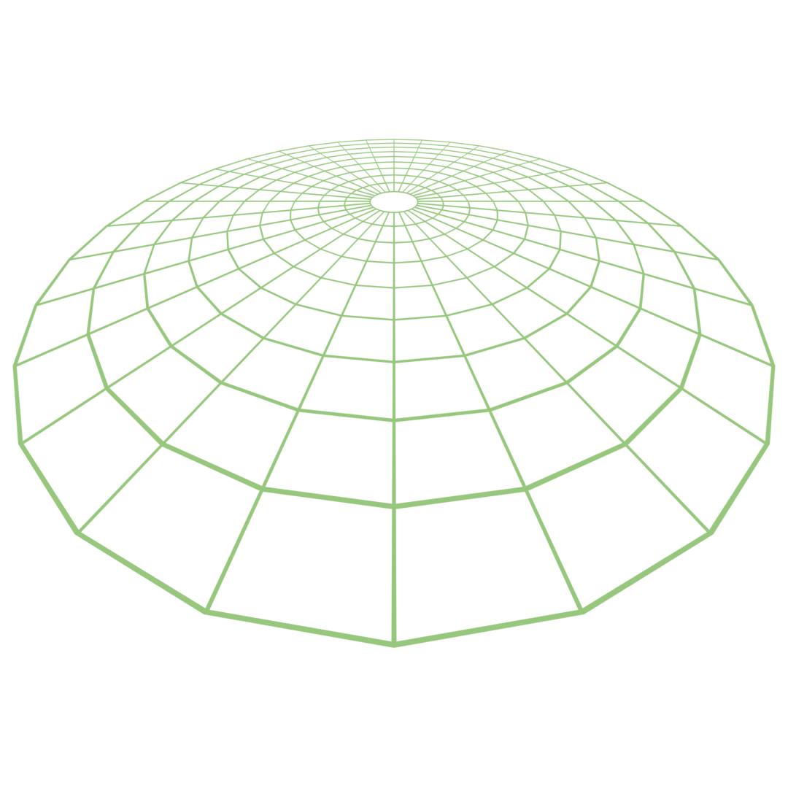
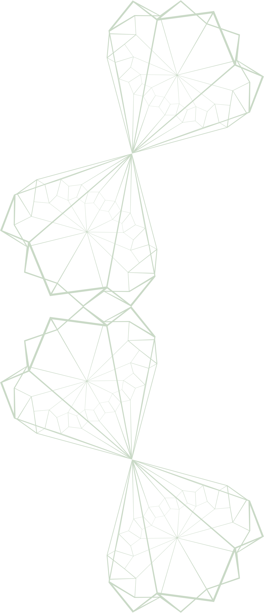
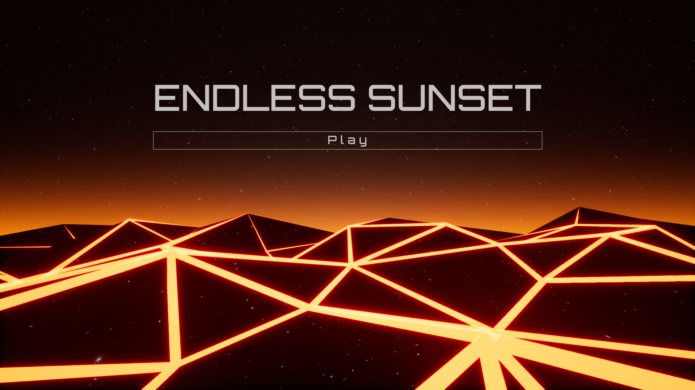

<InternalSectionGalleryLeft>

## About
### The Project

> This project started as an (attempted) entry to LD50 and evolved into a project to begin learning Unreal Engine.
>
> The game is a 3rd person shooter where you are in a dream fighting off zombies. As you shoot your gun, your power meter raises as well as getting hit by a zombies attack. The meter is connected to time of day, empty at night time and full just as the sun comes up. Once the sun is up, you "wake up" in your bed and realize you are late! This causes the player to have to make sure they do not shoot too much while also killing and avoiding enemies.

---

<ImageSet1 />

</InternalSectionGalleryLeft>

<InternalSectionGenericRight>

## Project
### Goals

<InternalSubsectionGRBlockquote>

[//]: <> (//)

<InternalSubsectionGRWrapper>

<InternalSubsectionGRImage>

</InternalSubsectionGRImage>

<InternalSubsectionGRText>

#### Lorem Ipsum 
The main goal of this project was to get myself familiar with Unreal Engine. Everything was either made from scratch or taken from Unreal's example projects.

</InternalSubsectionGRText>

</InternalSubsectionGRWrapper>

[//]: <> (//)

<InternalSubsectionGRWrapper>

<InternalSubsectionGRImage>

</InternalSubsectionGRImage>

<InternalSubsectionGRText>

#### Lorem Ipsum 
The main goal of this project was to get myself familiar with Unreal Engine. Everything was either made from scratch or taken from Unreal's example projects.

</InternalSubsectionGRText>

</InternalSubsectionGRWrapper>

[//]: <> (//)

<InternalSubsectionGRWrapper>

<InternalSubsectionGRImage>

</InternalSubsectionGRImage>

<InternalSubsectionGRText>

#### Lorem Ipsum 
The main goal of this project was to get myself familiar with Unreal Engine. Everything was either made from scratch or taken from Unreal's example projects.

</InternalSubsectionGRText>

</InternalSubsectionGRWrapper>

[//]: <> (//)

</InternalSubsectionGRBlockquote>

</InternalSectionGenericRight>

[//]: <> (////)

<InternalSectionGenericLeft>

## Project
### Goals

<InternalSubsectionGLBlockquote>

[//]: <> (//)

<InternalSubsectionGLWrapper>

<InternalSubsectionGLImage>

</InternalSubsectionGLImage>

<InternalSubsectionGLText>

#### Lorem Ipsum 
The main goal of this project was to get myself familiar with Unreal Engine. Everything was either made from scratch or taken from Unreal's example projects.

</InternalSubsectionGLText>

</InternalSubsectionGLWrapper>

[//]: <> (//)

<InternalSubsectionGLWrapper>

<InternalSubsectionGLImage>

</InternalSubsectionGLImage>

<InternalSubsectionGLText>

#### Lorem Ipsum 
The main goal of this project was to get myself familiar with Unreal Engine. Everything was either made from scratch or taken from Unreal's example projects.

</InternalSubsectionGLText>

</InternalSubsectionGLWrapper>

[//]: <> (//)

<InternalSubsectionGLWrapper>

<InternalSubsectionGLImage>

</InternalSubsectionGLImage>

<InternalSubsectionGLText>

#### Lorem Ipsum 
The main goal of this project was to get myself familiar with Unreal Engine. Everything was either made from scratch or taken from Unreal's example projects.

</InternalSubsectionGLText>

</InternalSubsectionGLWrapper>

[//]: <> (//)

</InternalSubsectionGLBlockquote>

</InternalSectionGenericLeft>

[//]: <> (////)

<InternalSectionGalleryRight>

## Project
### Goals

>The main goal of this project was to get myself familiar with Unreal Engine. Everything was either made from scratch or taken from Unreal's example projects. Topics learned during this project included: Menus, HUD, dynamic time of day, character movement, weapons, glowing materials, adding new animations from Mixamo, enemy navigation and attacking, muzzle flashes, bullet tracers, background music and spatial audio.

---

<ImageSet1 />

</InternalSectionGalleryRight>